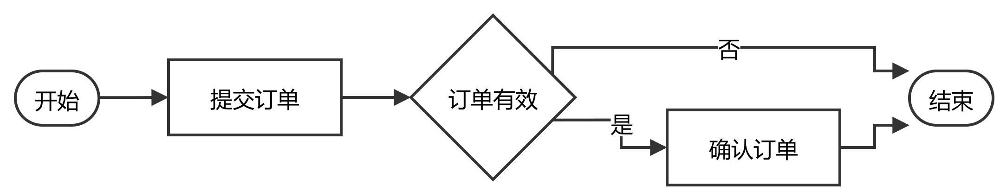
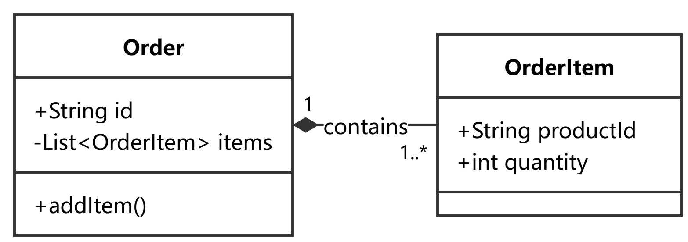
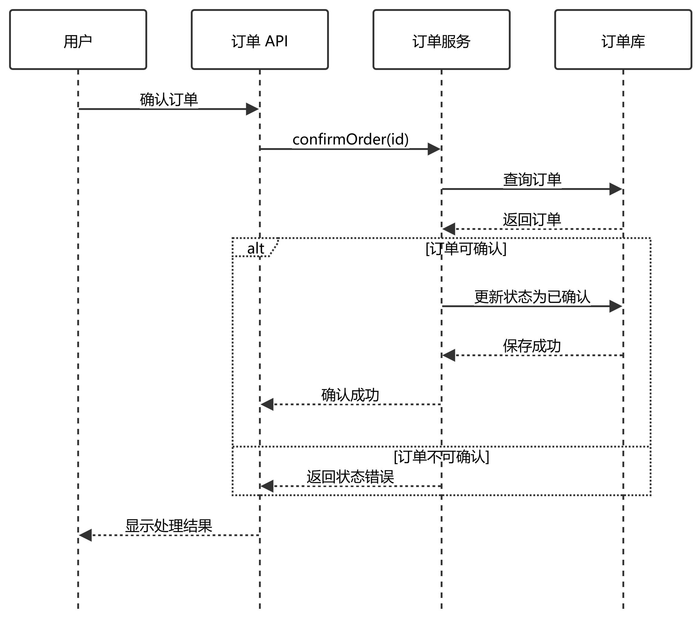
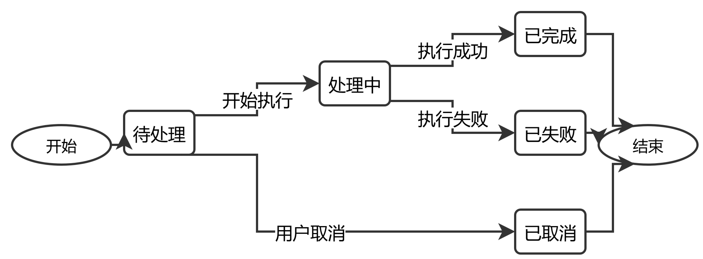
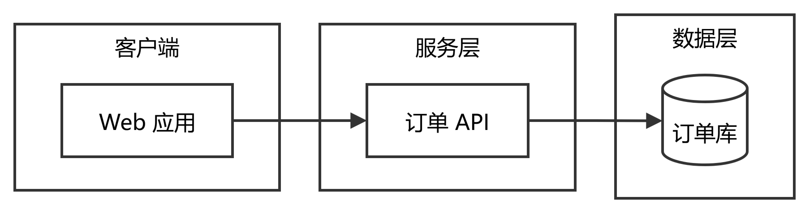

# Diagram examples

Each preview shows the local style pass after Mermaid conversion, before any target-document-specific routing corrections. The `.mmd` file beside each preview remains its editable source; the matching `.drawio` file is the converted output.

| Type | Source | Preview | H/W |
|---|---|---|---:|
| Flowchart | [flowchart-order-confirm.mmd](flowchart-order-confirm.mmd) | [PNG](preview/flowchart-order-confirm.png) | 0.19 |
| Class | [class-order-lifecycle.mmd](class-order-lifecycle.mmd) | [PNG](preview/class-order-lifecycle.png) | 0.35 |
| Sequence | [sequence-order-confirm.mmd](sequence-order-confirm.mmd) | [PNG](preview/sequence-order-confirm.png) | 0.89 |
| State machine | [state-task-lifecycle.mmd](state-task-lifecycle.mmd) | [PNG](preview/state-task-lifecycle.png) | 0.37 |
| Structure / component | [structure-service-layers.mmd](structure-service-layers.mmd) | [PNG](preview/structure-service-layers.png) | 0.26 |

For a target document width `W_doc`, estimate the placed height as `H_doc = W_doc × H/W`. The PNG export uses scale 3; this does not change its aspect ratio.

## Flowchart

## Class diagram

## Sequence diagram

## State machine

## Structure / component diagram

The two radar flowcharts are larger examples. Their previews are included to show why document fit must be checked independently of node count:

- [fig-control-flow.png](preview/fig-control-flow.png)
- [fig-detect-flow.png](preview/fig-detect-flow.png)
